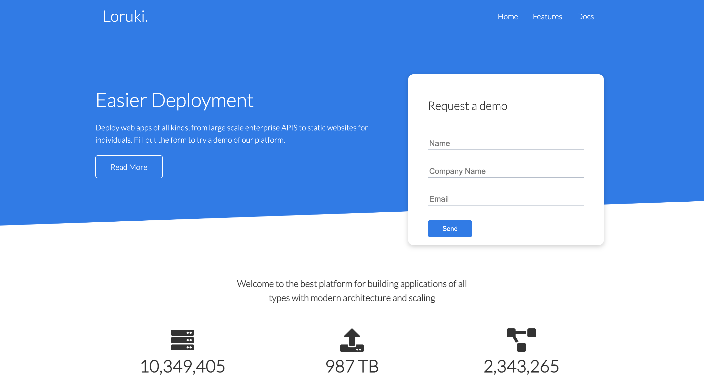
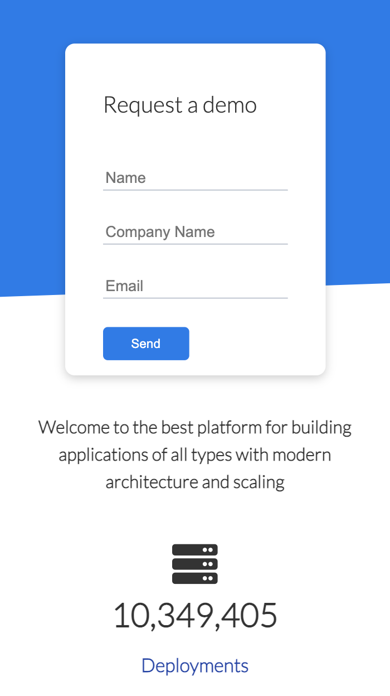

# Traversy Media - Loruki website tutorial

This is a website for a pretend cloud-hosting platform that I created by following [this tutorial](https://www.youtube.com/watch?v=p0bGHP-PXD4) by Traversy Media. It has three pages (home, features, docs) and a form, which has been deployed on Netlify. It also has a responsive design, so it looks good on both mobile and desktop. 

### Screenshot

   
   

### Links
- Netlify URL (with form deployment): [https://epic-heyrovsky-1ddec5.netlify.app](https://epic-heyrovsky-1ddec5.netlify.app)
- Second live site URL: [https://ellieroy.github.io/loruki-website/](https://ellieroy.github.io/loruki-website/)

### Built with 
- Semantic HTML5 markup
- CSS custom properties
- Flexbox
- CSS Grid

## Acknowledgements 
I followed the tutorial created by [Traversy Media](https://www.youtube.com/watch?v=p0bGHP-PXD4) in order to create this website. This helped me to learn CSS Grid and Flexbox, as well as CSS custom properties. Thanks for sharing!
